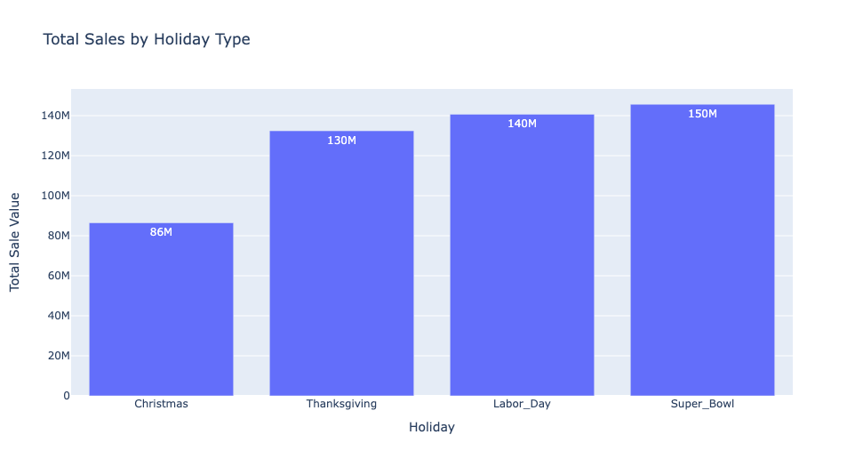

## Sales Forecasting

[Link to Notebook](https://github.com/vytla/capstone-part2/blob/main/sales-forecasting-part-2.ipynb)

### Executive summary

In this application, the goal is to explore a Kaggle dataset containing sales information from Walmart. The primary objective is to utilize advanced AI/ML models for accurate sales forecasting. Through rigorous feature engineering, guided by the CRISP-DM (Cross-Industry Standard Process for Data Mining) methodology, the aim is to derive actionable insights and enhance prediction accuracy. This project encompasses the six key phases of CRISP-DM: Business Understanding, Data Understanding, Data Preparation, Modeling, Evaluation, and Deployment, ensuring a structured and comprehensive approach to data analysis and model development.

### Rationale

Sales forecasting is a vital tool that drives informed decision-making, optimizes operations, enhances financial planning, and ultimately contributes to the sustainable growth and success of a business.It primarly helps busines in Resource Planning,Financial Planning,Strategic Decision Making, Performance Measurement and Stakeholder Confidence.

### Research Question

How can AI/machine learning models be optimized to improve the accuracy of sales predictions?

### Data Sources

Selected Wallmart Sales Dataset from [Kaggle ](https://www.kaggle.com/datasets/iamprateek/wallmart-sales-forecast-datasets) 

### Methodology

What methods are you using to answer the question?
Followed CRISP-DM (Cross-Industry Standard Process for Data Mining) methodology for Feature Engineering.

##### Business Understanding

By thoroughly understanding datasets and AI/ML models, we can develop a more effective and reliable sales forecasting model that aligns with Walmart's strategic goals and operational needs.Some of the following business questions will be addressed as part of this capstone

- How can we improve the accuracy of sales forecasting methods?
- What are the peak sales periods, and how can we prepare for them?
- How do different factors (e.g., holidays, promotions, economic conditions) affect sales?
- Which stores and departments have the most volatile sales patterns?

##### Data Understanding

Given dataset has 4 .csv files and after loading these files, following are some of the metrics . 

##### Stores Dataset
Total 45 samples with 3 features.

| #   | Column        | Non-Null Count | Dtype    |
| --- | ------------- | -------------- | -------- |
| 0   | Store         | 45             | int64    |
| 1   | Type          | 45             | object   |
| 2   | Size          | 45             | int64    |

##### Features Dataset
Total 8190 samples and 15 fetures exists from this datset

| #   | Column        | Non-Null Count | Dtype    |
| --- | ------------- | -------------- | -------- |
| 0   | Store         | 421570         | int64    |
| 1   | Dept          | 421570         | int64    |
| 2   | Date          | 421570         | object   |
| 3   | Weekly_Sales  | 421570         | float64  |
| 4   | IsHoliday     | 421570         | bool     |
| 5   | Temperature   | 421570         | float64  |
| 6   | Fuel_Price    | 421570         | float64  |
| 7   | MarkDown1     | 150681         | float64  |
| 8   | MarkDown2     | 111248         | float64  |
| 9   | MarkDown3     | 137091         | float64  |
| 10  | MarkDown4     | 134967         | float64  |
| 11  | MarkDown5     | 151432         | float64  |
| 12  | CPI           | 421570         | float64  |
| 13  | Unemployment  | 421570         | float64  |
| 14  | Type          | 421570         | object   |
| 15  | Size          | 421570         | int64    |

By joining above two datsets, we can get following few data insights.

###### Total Sales by Holiday Type 

###### Observations :

- Super Bowl has higher sales compared to other holidays Chrismas,Thanks Giving,and Labor Day.
- Total Holiday Sales contribution is 7.50 % of Total sales(refer notebook ).

######  Weekly Sales by Store Type

###### Observations

- Type A stores are contributing to higher number of sales
- Type C stores are having less sales

######  Total Monthly Weekly Sales

###### Observations

- April and July months are contributing higher sales 
- January and November sales are lower compared to other mothly sales.
- All months sales are above 300M

###### Correlation between Weekly Sales and other Features

###### Observations 
- Size,Type_A and DEPT features storgly correlated with Weekly Sales feature. 
- Store,Type_c and Type_b are least negatively correlated

### Data Preperation 

Normalizing and scaling the data not only improves the performance of the models but also ensures that the models are robust and reliable in making predictions.

As part of the first phase of our Capstone project, we used the pandas library's get_dummies function to normalize the dataset. This process involves converting categorical variables into a format that can be easily used by machine learning algorithms

After normalizing the dataset using get_dummies, the next step involves scaling the numeric features to ensure that all features contribute equally to the model's performance. I have used StandardScaler to scale dataset. 

- Based on Date and IsHoliday feature, created four edditional holday features Super_Bowl,Labor_Day,Thanksgiving And Christmas

- Markdown1,Markdown2,Markdown3 and Markdown4 features are having more than 64% null values and these features will not add any value to our analysis and modeling. so dropped these set of features.
- figured out outliers in weekly sales bellow 0(negative sales) and above 30 thousand.

- Sorting dataframe based on Date,Store and Dept features for timeseries analysis.

- Created train data and test data of 70% and 30% 

### Modeling and Evaluation

- Created a Pipeline with Standard Scaler and Ridge Models
- Used GridSearchCV to figure out best model and their coefs between features.
- Following are mean squared errors(MSE) for train and test datsets.
    - Training data mse:  480863157.2570453
    - Testing data mse:  442402903.84863544
- Best Model from GridSearchCV
    -  Best_model:  Pipeline(steps=[('scaler', StandardScaler()), ('ridge', Ridge(alpha=1000.0))])

- Feature Importance based on GridSearchCV

    

- Create graph using rolling window of size 2 mean and standard deviation

    

- Check dataset is stationary using decompose. 

    
    
    - From above graph we can confirm datset is following trend and also seasonal

- Made datset stationary using diff method

- Created final model AUTO ARIMA to prections and forecast

    
    
- Identified Best Model parms with ARIMA model 
    - Best model:  ARIMA(3,0,2)(0,0,0)[1] intercept
    & Total fit time: 1.009 seconds
- Following is model summary 

    

### Results
What did your research find?

The predictions from the above model exhibit a slightly lower trend than the test data, indicating that the model consistently underestimates the test values. This discrepancy suggests that the current model might not be capturing all the relevant patterns or complexities in the data. 

### Next steps

Following are some of the techniques need to be considered to improve model performance and better prede tions. 

- Exploring alternative models from Nural Networks
- Techniques like K-Fold Cross-Validation can provide a more accurate measure of model performance
- Addressing Model Bias.
